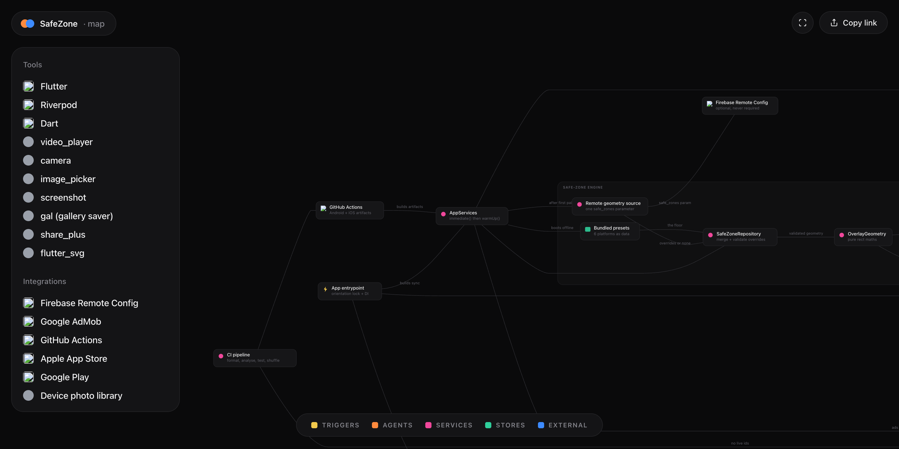

# SafeZone

Preview a vertical video against the real UI safe zones of every short-form feed — before you post it.

*Interactive, pannable version: [open the architecture map](https://fred-in-tech.github.io/architecture-maps/safezone-previewer/)*

## What it is

SafeZone is a Flutter app that draws a platform's interface over your footage so you can see what it covers. Load a clip, pick TikTok, Instagram Reels, YouTube Shorts, Snapchat Spotlight, Facebook Reels or Meta's 4:5 in-feed crop, and the app paints that feed's chrome, its hazard mask, and the green frame that survives on every device. The media pans and zooms underneath; the guides do not, because safe zones belong to the platform frame, not to your shot.

There is no login and no account. Every frame is decoded, composited and exported on the device — nothing is uploaded, ever. Status: **App Store submission prep** — both release targets build, the app has been driven end to end on iOS simulator and Android emulator, and what is left is store paperwork rather than code.

## Why I built it

I shoot and cut short-form video for a living. The recurring, expensive mistake is discovering after the export that the caption block is sitting on your subject's face, or that the action rail is covering the logo — and the only way to find out was to post it and look. Nobody was going to hand me a tool that showed the chrome before the upload, so I built one, and then made it good enough to ship: on-device only, one tap from the home screen to a platform check, and geometry I can correct the same day a platform moves its UI.

## Architecture

Feature-first Flutter with Riverpod, no server component at all.

| Layer | What runs there |
|---|---|
| **Entry** | `main.dart` builds services synchronously and calls `runApp`; four screens — home/library, editor, record, settings |
| **Safe-zone engine** | Bundled presets → `SafeZoneRepository` (merge + validate) → `OverlayGeometry` (pure maths) → painter + glyph layer |
| **Media** | `MediaSession` owns exactly one `video_player` decoder; viewport transforms the footage, transport scrubs below the canvas |
| **Capture** | Permissions → camera with bounded init → `CaptureStorage` moves the take out of the purgeable cache into app documents |
| **Export** | `RepaintBoundary` rasterise → `ExportService` (permission, naming, result) → `gal` adapter → device photo album → share sheet |
| **Stores** | Project library, thumbnails and takes in app documents; preferences in shared prefs. No remote store exists |
| **External** | Firebase Remote Config (optional geometry updates), AdMob (the only thing that leaves the device), GitHub Actions CI |

Three decisions shape the whole thing:

**Geometry is data, not code.** Each platform is a `SafeZoneConfig` quoting top header, bottom caption, right rail and left margin in pixels against a 1080×1920 master canvas, scaled onto whatever viewport the device gives it. Supporting a new feed is a row of numbers, not a code path.

**Bundled presets are the floor; remote config can only refine them.** A single Remote Config parameter holds a JSON object keyed by platform id. Partial objects are the norm — anything omitted keeps its bundled value, and an entry with an unknown id and complete geometry *adds* a platform without a store release. Anything malformed, or anything that would leave no usable canvas, is discarded in favour of the compiled default. The app is fully functional with no Firebase project and no network.

**Nothing external is allowed to be fatal, or even slow.** `AppServices.immediate()` is built from bundled presets with ads switched off, and `warmUp()` folds Firebase and AdMob in after first paint.

## Engineering highlights

- **Launch stopped waiting on the network.** `runApp` used to block on `Firebase.initializeApp`, a Remote Config fetch and three ad preloads. Measured with `flutter run --profile --trace-startup` by restoring the blocking call and running both: **3,642 ms → 1,091 ms** to first frame, on an emulator with a fast local network. The gap widens on mobile data. Worth recording how it was missed: the blank screen *was* observed early and treated as a launch-colour problem, so painting it the right shade made the symptom look intentional for another eight rounds.

- **The overlay must not repaint while the media moves.** Pinching rebuilds the widget every gesture frame, and the chrome layer opens a `saveLayer` so the whole mock UI fades as one object. `shouldRepaint` depends only on the platform and the toggles — never on zoom or media — and a test pins that, so a future field on the painter cannot quietly reintroduce the cost.

- **Full-screen ads resolve on dismissal, not on show.** The caller's next act after an export ad is to rasterise the canvas, and while an ad is up the Flutter surface is covered — on Android it may be paused outright. Resolving on "shown" would export a blank frame. The rule was written from reasoning long before it could be tested; a device run with real units later caught the same bug in its other half, where the pre-export capture could run behind a still-visible ad.

- **One decoder, and the order it dies in matters.** `MediaSession` disposes the outgoing handle as its *first* act, so the old clip leaves state before the swap. Get it backwards and a widget rebuilds against a dead texture — invisible in the happy path, and a crash on the second file the user opens, which is exactly how it was found. Every leak path (superseded load, failed init, completion after dispose) is pinned by a test against an abstracted handle rather than a real decoder.

- **The camera hangs rather than throwing.** `availableCameras()` and `initialize()` can wedge indefinitely when the platform camera service is stuck — a real Android state — and the screen's only answer was a permanent spinner. Both are now time-bounded onto the same explainable error state as any other failure. It surfaced because the first widget tests written for that screen *hung*, which was the bug.

- **The app deletes only what it created.** A recorded take exists nowhere else, so deleting a project has to clean up after it — but a project can just as easily point at a clip from the user's own photo library, and deleting someone's original footage is far worse than the storage leak it fixes. Ownership is gated on the app's own captures folder, and that check carries more tests than the cleanup does.

- **Accessibility and contrast are asserted, not eyeballed.** One suite measures every text-on-surface pair in both themes against WCAG; another runs Flutter's own tap-target, label and rendered-contrast guidelines against every screen, in both themes, at text scales up to 3.1×. Between them they found white-on-accent at 3.16:1 behind every primary button, guide toggles at 46×46 against Android's 48dp minimum, and an empty-state scrim translucent enough that its copy sat on a blend rather than the palette colour it named.

- **CI gates what the repo must never contain.** Every job in `.github/workflows/ci.yml` exists because something got through once: format, analyser with `--fatal-infos`, tests, tests *shuffled* (a suite that only passes in declaration order is carrying failures that have not happened yet), coverage, then a secret scan that fails the build if a keystore, signing config or ad configuration is ever tracked — or if any AdMob publisher id other than Google's public test one appears in source. Build jobs then produce an obfuscated Android bundle with its debug symbols and an unsigned iOS release.

## Stack

| Layer | Tech |
|---|---|
| App | Flutter 3.41 / Dart 3.11, feature-first modules |
| State | Riverpod, with the decoder hosted in the editor's provider scope |
| Playback | `video_player` behind a `PlayableHandle` interface |
| Capture | `camera`, `image_picker`, `permission_handler` |
| Rendering | `CustomPainter` overlay + `flutter_svg` glyph layer |
| Export | `screenshot` (RepaintBoundary) → `gal` → `share_plus` |
| Storage | App documents (projects, takes, thumbnails), `shared_preferences` |
| Remote | Firebase Remote Config — optional, with compiled defaults as the floor |
| Monetisation | AdMob; ad unit ids supplied via config templates, never committed |
| CI | GitHub Actions — analyse, test, shuffled test, secret scan, Android + iOS builds |

## Status & roadmap

App Store submission prep. Both release targets compile; the signed, obfuscated, fully ad-configured artifact has been built and run, and the app has been driven end to end on an iPhone simulator and a Pixel emulator against a purpose-built 1080×1920 test clip with encoded band edges — the green safe frame lands exactly on them, which is what makes the geometry provably correct rather than merely plausible.

Open, and honestly open:

- **App Tracking Transparency.** Nothing requests ATT, so AdMob serves non-personalised ads only — materially lower revenue. Adding it means a prompt that says "allow tracking" in an app whose home screen promises everything stays on the device. That is a positioning call, not a technical one, and it is deliberately unresolved.
- **SKAdNetwork identifiers.** Only Google's own is listed; the mediation list needs copying from current documentation rather than recalled.
- Store paperwork on both platforms: listings, screenshots, privacy policy URL, data-safety and App Privacy disclosures.

Next in the code: more platform presets (a row of numbers each), and a device-tested pass on frame timings — the current repaint guarantee is architectural, and real numbers need real hardware, since the Android emulator renders in software.

## About this repo

This is a public architecture showcase of a private production codebase. The source stays private; this repo documents how it is built. No credentials, signing material or ad unit ids appear here or in the private tree — the app ships with Google's public test units by default and reads real ones from gitignored config templates, and CI fails the build if that ever stops being true.

— Godfred Aidoo · [godfredaidoo.com](https://godfredaidoo.com) · [LinkedIn](https://www.linkedin.com/in/godfred-aidoo) · [more projects](https://github.com/Fred-In-tech)
